# Levelup

# Summary

[Levelup](https://lvl-up-app.herokuapp.com/), (https://lvl-up-app.herokuapp.com/), is a Meetup clone designed to allow users to plan gaming related events with other users.

- Create an account or use demo login
- Log in / Log out
- View events that other users have created.
- Create events that other users can view.
- Edit events you have created.
- Delete events you have created.

## Levelup uses:

- CSS
- Express
- JavaScript
- PostgreSQL
- React
- Redux
- Sequelize

# Installation

1. Clone Levelup repository from https://github.com/SuhaylKhan/levelup.git

2. Run `npm install` in `backend` directory

3. Create `.env` file in `backend` directory following example in `.envexample`

    - Make sure to create a psql user with a password and CREATEDB priviledges on your local machine

4. Run `npm run db:create` in `backend` directory

5. Run `npm run db:migrate` in `backend` directory

6. Run `npm run db:seed:all` in `backend` directory

7. Run `npm install` in `frontend` directory

8. Run `npm start` in `backend` AND `frontend` directories

    - Levelup should open automatically in a new tab using Google Chrome. If not, navigate to localhost:3000

# Feature List

### Sign up, log in, and log out

- Users can create a new account, sign into an existing account, sign into a demo account, and log out of their account

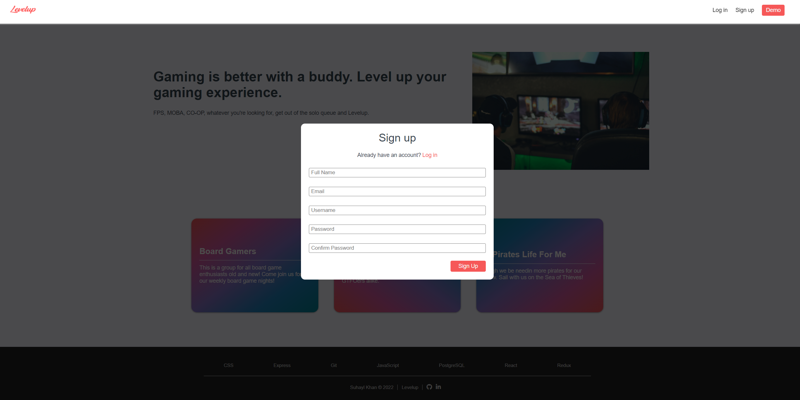
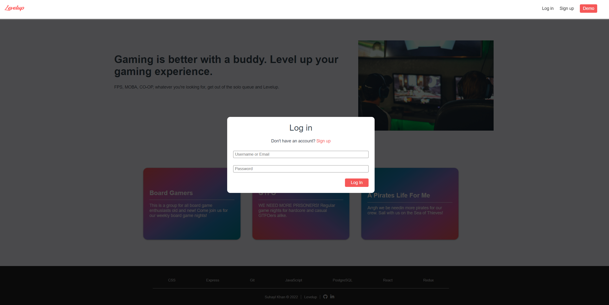

- Logged in users are directed to their profile page which displays their groups and upcoming events

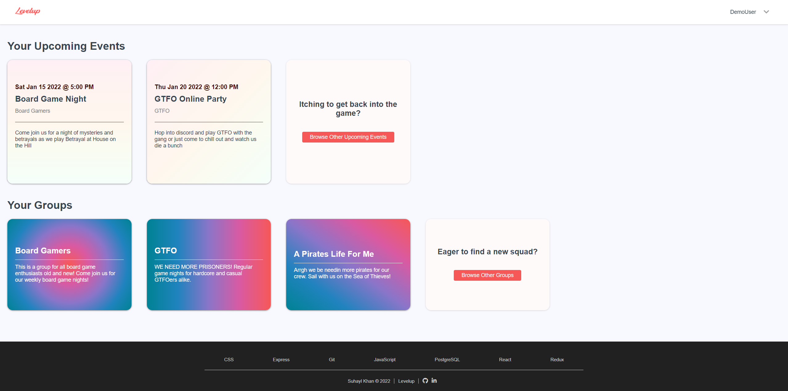

- Logged out users are directed to the Levelup home page

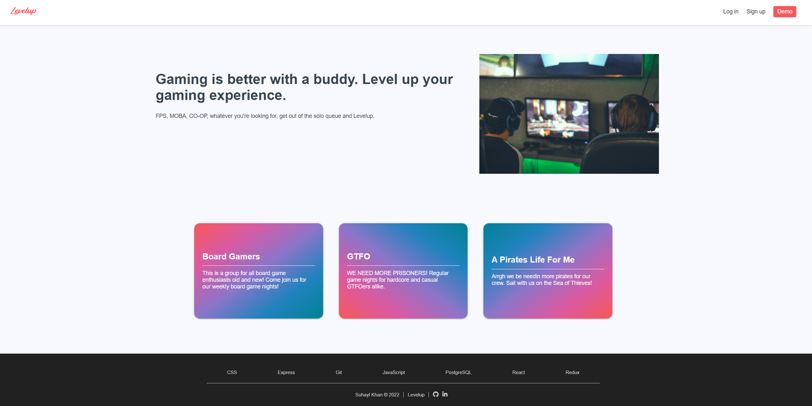

### Events

- Logged in users can view events other users have created

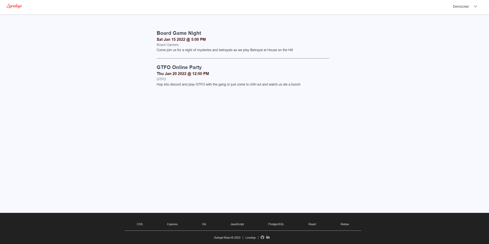
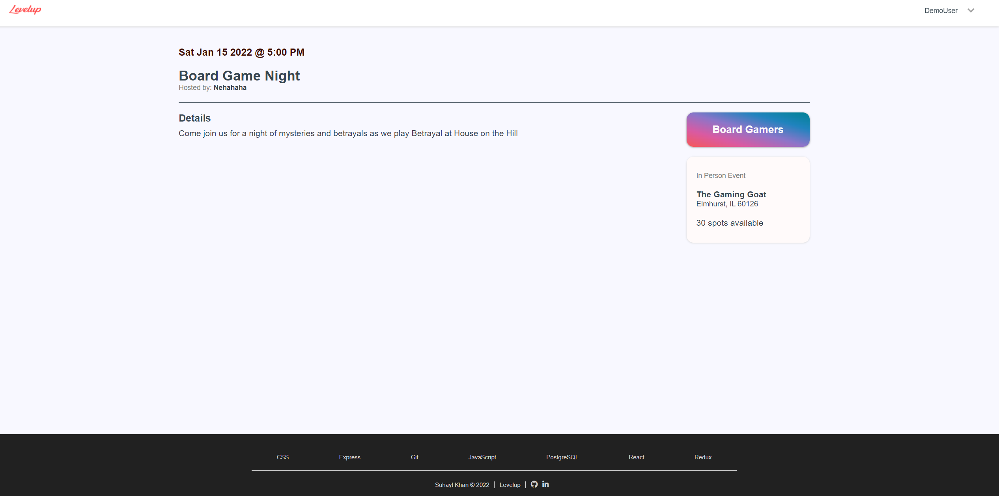

- Logged in users can create events that other users can view

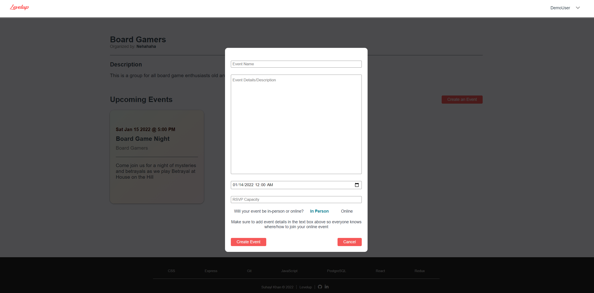

- Logged in users can edit events they have created

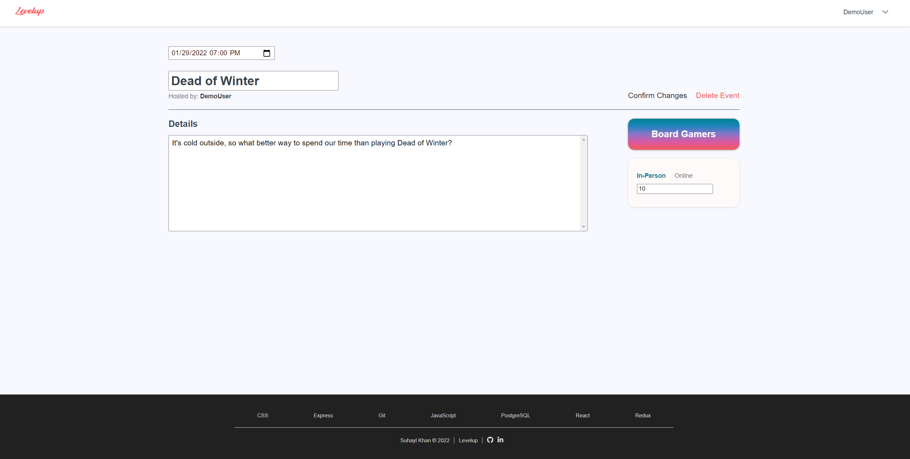

- Logged in users can delete events they have created

### Groups

- Logged in users can view existing groups

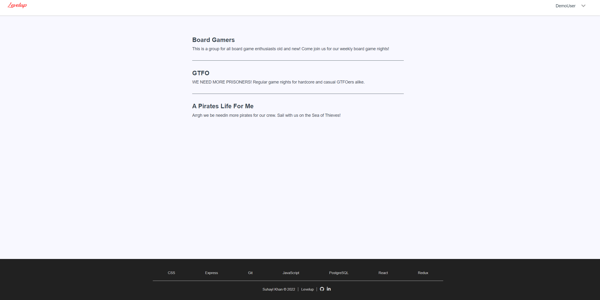
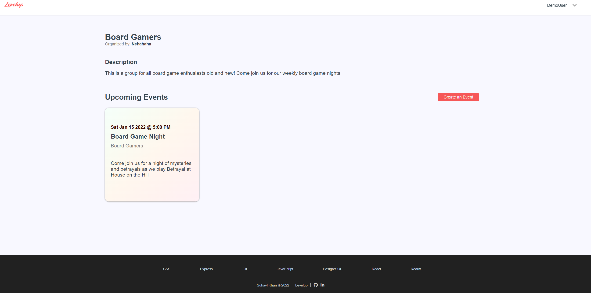

## Future Features

### Groups

- Logged in users can create groups that other users can view and join
- Logged in users can edit groups they have created
- Logged in users can delete groups they have created
- Logged in users can join groups other users have created

### RSVP

- Logged in users can RSVP to events
- Logged in users can view who has RSVP'd to events

# React Components

- AuthFormModal
- CreateEventForm
- EditEventForm
- EventDetails
- Events
- EventsPreview
- Footer
- GroupDetails
- GroupPreview
- Groups
- LoginFormModal
- Navigation
- SignupFormModal
- Splash
- UserProfile

# Database Schema

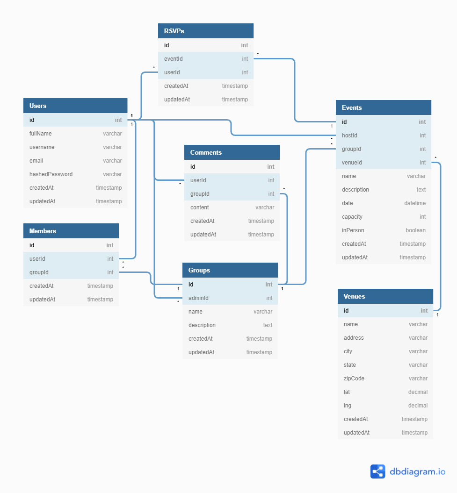

## Users

| Column Name    | Datatype      | Constraints      |
|----------------|---------------|------------------|
| id             | INTEGER       | PK, NOT NULL     |
| fullName       | STRING(100)   | NOT NULL         |
| username       | STRING(30)    | NOT NULL, UNIQUE |
| email          | STRING(256)   | NOT NULL, UNIQUE |
| hashedPassword | STRING.BINARY | NOT NULL         |
| createdAt      | TIMESTAMP     | NOT NULL         |
| updatedAt      | TIMESTAMP     | NOT NULL         |

## Groups

| Column Name | Datatype    | Constraints      |
|-------------|-------------|------------------|
| id          | INTEGER     | PK, NOT NULL     |
| adminId     | INTEGER     | NOT NULL, FK     |
| name        | STRING(100) | NOT NULL, UNIQUE |
| description | TEXT        | NOT NULL         |
| createdAt   | TIMESTAMP   | NOT NULL         |
| updatedAt   | TIMESTAMP   | NOT NULL         |

- `adminId` references `Users` table

## Events

| Column Name | Datatype    | Constraints  |
|-------------|-------------|--------------|
| id          | INTEGER     | PK, NOT NULL |
| hostId      | INTEGER     | NOT NULL, FK |
| groupId     | INTEGER     | NOT NULL, FK |
| venueId     | INTEGER     | FK           |
| name        | STRING(100) | NOT NULL     |
| description | TEXT        | NOT NULL     |
| date        | DATE        | NOT NULL     |
| capacity    | INTEGER     | NOT NULL     |
| inPerson    | BOOLEAN     | NOT NULL     |
| createdAt   | TIMESTAMP   | NOT NULL     |
| updatedAt   | TIMESTAMP   | NOT NULL     |

- `hostId` references `Users` table
- `groupId` references `Groups` table
- `venueId` references `Venues` table

## Venues

| Column Name | Datatype    | Constraints      |
|-------------|-------------|------------------|
| id          | INTEGER     | PK, NOT NULL     |
| name        | STRING(100) | NOT NULL         |
| address     | STRING(256) | NOT NULL         |
| city        | STRING(100) | NOT NULL         |
| state       | STRING(50)  | NOT NULL         |
| zipCode     | STRING(25)  | NOT NULL         |
| lat         | DECIMAL     | NOT NULL         |
| lng         | DECIMAL     | NOT NULL         |
| createdAt   | TIMESTAMP   | NOT NULL         |
| updatedAt   | TIMESTAMP   | NOT NULL         |

## Members

| Column Name | Datatype  | Constraints  |
|-------------|-----------|--------------|
| id          | INTEGER   | PK, NOT NULL |
| userId      | INTEGER   | NOT NULL, FK |
| groupId     | INTEGER   | NOT NULL, FK |
| createdAt   | TIMESTAMP | NOT NULL     |
| updatedAt   | TIMESTAMP | NOT NULL     |

- `userId` references `Users` table
- `groupId` references `Groups` table

## RSVPs

| Column Name | Datatype  | Constraints  |
|-------------|-----------|--------------|
| id          | INTEGER   | PK, NOT NULL |
| eventId     | INTEGER   | NOT NULL, FK |
| userId      | INTEGER   | NOT NULL, FK |
| createdAt   | TIMESTAMP | NOT NULL     |
| updatedAt   | TIMESTAMP | NOT NULL     |

- `eventId` references `Events` table
- `userId` references `Users` table

## Comments

| Column Name | Datatype  | Constraints  |
|-------------|-----------|--------------|
| id          | INTEGER   | PK, NOT NULL |
| userId      | INTEGER   | NOT NULL, FK |
| groupId     | INTEGER   | NOT NULL, FK |
| content     | TEXT      | NOT NULL     |
| createdAt   | TIMESTAMP | NOT NULL     |
| updatedAt   | TIMESTAMP | NOT NULL     |

- `userId` references `Users` table
- `groupId` references `Groups` table

# Frontend Routes

## Splash/User Profile

- `/`
- `/users/:userId`

## Events

- `/events`
- `/events/:eventId`
- `/events/:eventId/edit`

## Groups

- `/groups`
- `/groups/:groupId`

# Backend Routes

## Session

All session routes begin with `/api/session`

- GET `/`
- POST `/`
- DELETE `/`

## Users

All users routes begin with `/api/users`

- GET `/:userId/events`
- GET `/:userId/groups`
- POST `/`

## Events

All events routes begin with `/api/events`

- GET `/`
- POST `/`
- PUT `/:eventId`
- DELETE `/:eventId`

## Groups

All groups routes begin with `/api/groups`

- GET `/`
- GET `/:id`
